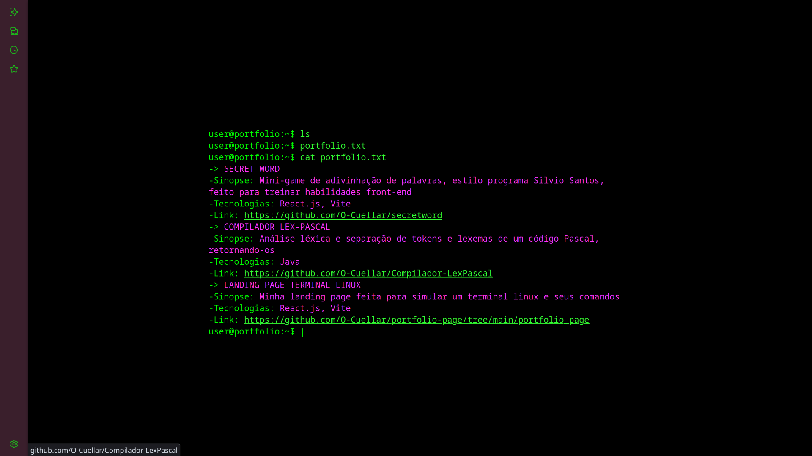

# Landing Page 🌐

Uma LandingPage feita usando Vite+React.js para simular um terminal Linux.
Com um efeito que faz com que as linhas de comandos simuladas sejam escritas automaticamente

## Link para acessar

https://o-cuellar.github.io/portfolio_page/

## Como acessar o modelo localmente

1. Clone o repositório  
2. Instale as dependências com npm install  
3. Rode o projeto com npm run dev  
4. Acesse http://localhost:3000 no seu navegador

## Tecnologias usadas

- React  
- Vite  
- JavaScript (ES6+)  
- CSS Modules  

## Demo

## Licença

MIT License
